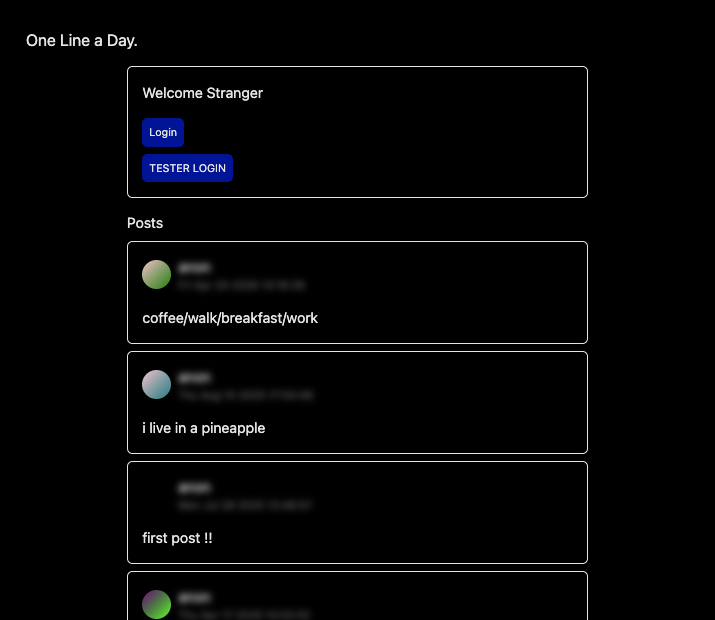
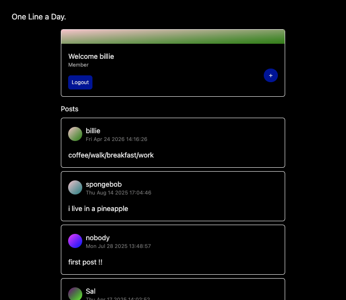
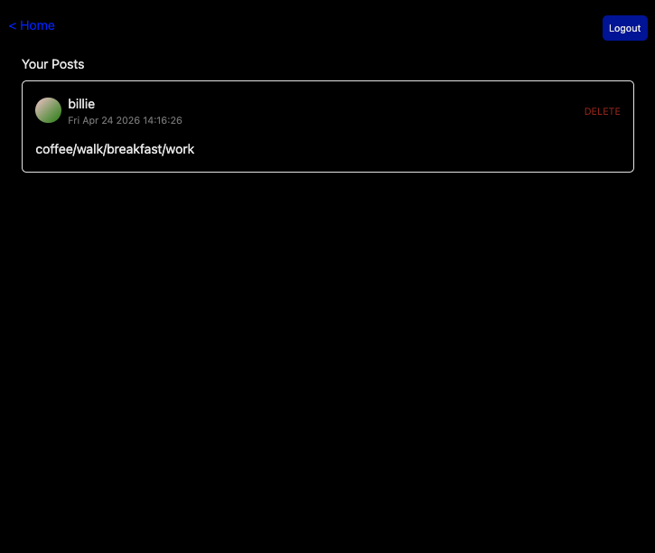
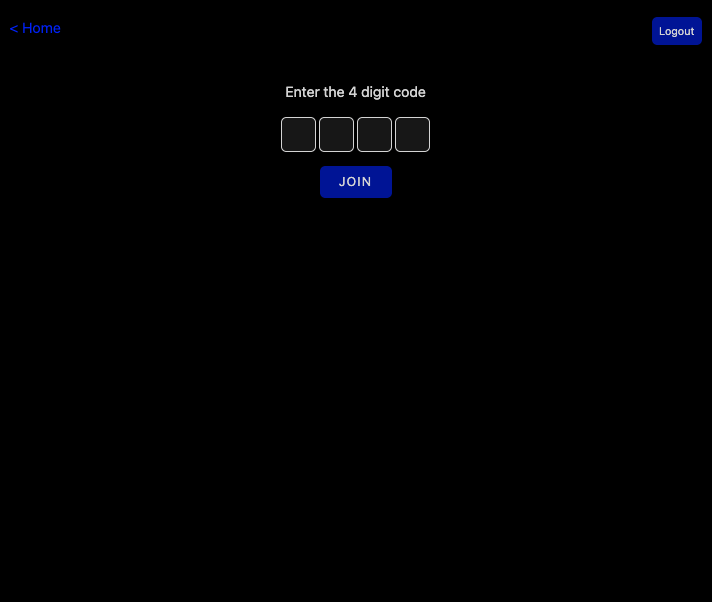

# ONE LINE A DAY.

A micro blogging app where only members can write posts and view who the author of a post is.
Non-members can only see the content and wonder who wrote it.
To join the club, users must enter the secret 4 digit passcode. **To join, use [4949]**

**[View Site](https://onelineaday.vercel.app)**

## Built With

- Express.js
- Node.js
- EJS
- MongoDB
- Redux
- JWT Authentication

## Features

- User registration and login
- Membership access via secret passcode
- Create and delete one line daily posts
- Anonymous authors for non-members
- Tester login

## At a Glance

|            Landing             |            Members             |
| :----------------------------: | :----------------------------: |
|  |  |

|          User's Posts          |           Secret Pin            |
| :----------------------------: | :-----------------------------: |
|  |  |

## Getting Started

1. Clone this repository and run:

```bash
npm install
```

2. Run the app

Server

```bash
npm run dev
```
